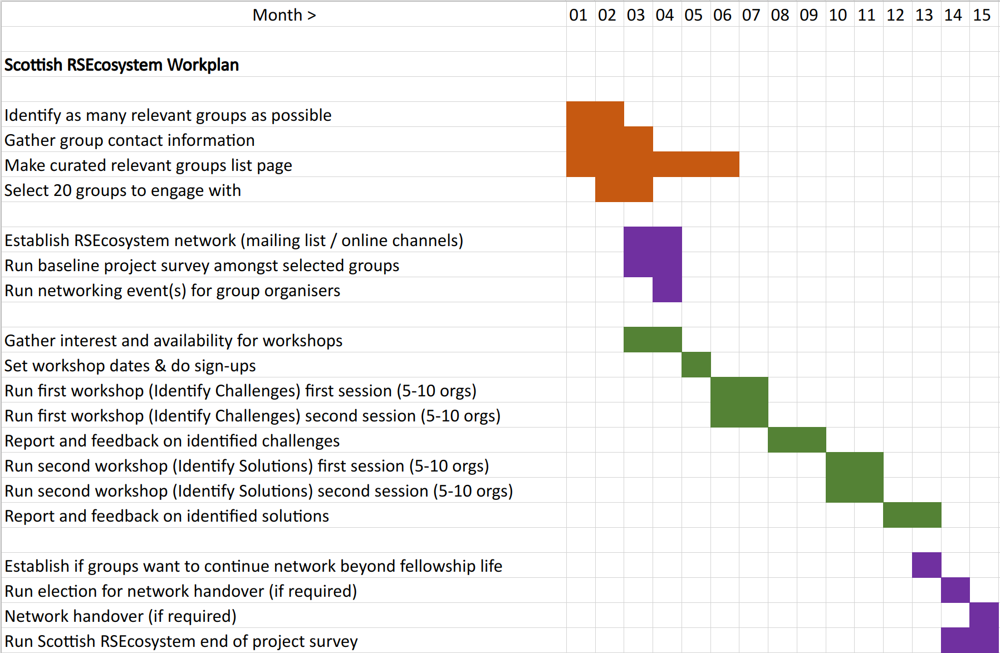

```{r setup, include=FALSE}
knitr::opts_chunk$set(echo = FALSE)
```

<script src="https://ajax.googleapis.com/ajax/libs/jquery/1.12.2/jquery.min.js"></script>

<script>
    $(document).ready(function() {
      $('slide:not(.title-slide, .backdrop, .segue)').append('<footer label=\"bit.ly/RSEcosystem"></footer>');    
    })
</script>

<style>
  footer:after {
    content: attr(label);
    font-size: 12pt;
    position: absolute;
    bottom: 20px;
    left: 100px;
    line-height: 1.9;
  }
</style>

<style type="text/css">
slides > slide:not(.nobackground):after {
  content: '';
}
</style>

<div class="notes">

Bio: 

Currently a PhD Researcher at EPCC, School of Informatics, at the University of Edinburgh. 
TODO Research Project:

Flic Anderson has been a Research Assistant in Bioinformatics in the Wallace Lab (within the Institute for Cell Biology) at the University of Edinburgh. 
Flic was part of the development team for the 'riboviz' open source software package for processing and analysis of ribosome profiling data, working with colleagues from EPCC (University of Edinburgh) to make the codebase more robust & sustainable.   

With a background in Ecology and Botany (previously a Research Assistant at the Royal Botanic Garden Edinburgh), Flic has worked with a wide range of types of biological data using different software tools and programming languages (particularly R) for the last 8 years, and found herself drawn towards bioinformatics and research software engineering. 

Flic is a member of the Edinburgh Carpentries and a certified Carpentries instructor in foundational coding and data science skills for researchers. 


Title: 

SSI Fellowship Application. 


Abstract:  


</div>


# SSI Fellowship Application 2023: 
Scottish RSEcosystem Network 

Felicity 'Flic' Anderson

# About me

## Me!

<div style="float: left; width: 30%;">
```{r, out.width = "300"}
knitr::include_graphics("https://raw.githubusercontent.com/FlicAnderson/EdinbR-20210519/main/images/Me.jpg")
```  

[GitHub](https://github.com/FlicAnderson), [Twitter](https://twitter.com/Flic_Anderson), [LinkedIn](https://www.linkedin.com/in/flicanderson/)
</div>

<div style="float: right; width: 55%;">
### Felicity 'Flic' Anderson  

* Ecology (BSc *hons*) & Botany (MSc) at University of Edinburgh.
* Research Assistant for 8 years at [Royal Botanic Garden Edinburgh](https://www.rbge.org.uk/) 
* Research Assistant in Bioinformatics for 2 years at [Wallace Lab](https://ewallace.github.io/), University of Edinburgh  
* Member of Society of Research Software Engineering 

</div>

<div class="notes"> 

* I've been involved in some pretty exciting research, and gotten stuck in at all stages of the research process: 
 - grant proposal writing 
 - project planning 
 - facilitating workshops 
 - running training courses
 - disseminating research 
 - writing reports and papers  
 - presenting 
 
</div>


## Me!

<div style="float: left; width: 30%;">
```{r, out.width = "300"}
knitr::include_graphics("https://raw.githubusercontent.com/FlicAnderson/EdinbR-20210519/main/images/Me.jpg")
```  

[GitHub](https://github.com/FlicAnderson), [Twitter](https://twitter.com/Flic_Anderson), [LinkedIn](https://www.linkedin.com/in/flicanderson/)
</div>

<div style="float: right; width: 55%;">
* Certified [Carpentries](https://carpentries.org/) instructor (delivering foundational data, software & coding courses) 
* Supervised several undergrad & masters students on ['riboviz'](https://github.com/riboviz/riboviz) research software project
* Outreach projects such as [4273pi](https://4273pi.org/) projects getting bioinformatics into Scottish schools 
* I <3 community events - CERSE, EdinbR, ReproducibiliTea, R-Ladies, WomenWhoCode, Data Fest, RstudioGlobal, Turing Fest, SSI Collaborations Workshops...
</div>


<div class="notes"> 

https://raw.githubusercontent.com/FlicAnderson/EdinbR-20210519/main/images/Me.jpg

https://edcarp.github.io/ - Edinburgh Carpentries, local chapter of The Carpentries organisation (https://carpentries.org/)
https://edcarp.github.io/Ed-DaSH/ - Ed-DaSH:  Data Science training programme for Health and Biosciences. 

</div>


## What I do  

* **First-Year PhD Student** at [EPCC](https://www.epcc.ed.ac.uk/), University of Edinburgh:  

"Coding Smart in Academia: *the effectiveness of software engineering techniques applied to research software projects*"   

* have given talks at [EdinbR](http://edinbr.org/) User Group & [EORC](https://edopenresearch.com/edinburghopenresearchconference/) (Edinburgh Open Research Conference)
* volunteered recently at [RSEcon22](https://rsecon2022.society-rse.org/) (Society of Research Software Engineering annual conference) 
* *I spend my time thinking about how to improve research software: a lot of the answer is about people & practice... *


# What I Want To Do... 

## 3-Strand Plan for the SSI Fellowship 

<div style="float: left; width: 35%;">
*Create a Scottish RSEcosystem:* 

 - **Identify** RSE-related groups
 - **Connect** them into a network
 - **Engage** to keep them running 
 
...aiming for a *self-sustaining network* that cooperates to support its members.
 
</div>

<div style="float: right; width: 52%;">
```{r, out.width = "400"}

```


## Scottish RSE community

< ScotRSE UNDER DEVELOPMENT > 

* There *are* Scottish RSEs, but still not at a self-sustaining self-organising ScotRSE community... 
  
  ... we have lots of skilled folks, but how/when do they realise they are RSEs? 
* How do we support people who may not have heard of Research Software Engineering or don't identify with the term? 
* How do we ensure that good software practices and research practices are available to support growing needs?
* **We need to look wider!**


<div class="notes">

There's the makings of a community, but it's not yet self-sustaining. A lot of people still don't know what RSE stands for, or whether they are one. Most people who probably meet the definition, might not know it!  

There are also lots of groups which are really valuable and relevant to giving folks the skills, knowledge and confidence they need to become fully-fledged RSEs, but they don't know that's what they're doing! 

We have the makings of a good foundation for a Scottish RSE community, but at the moment, it's shoogle-y. 

This fellowship plans to help RSE-related groups that are the foundation of our emerging ScotRSE community improve their sustainability, and to create opportunities to form connections between similar organisations, and to build networks that will help strengthen the ability of these groups to keep demonstrating best practices in RSE-related areas and growing the skills of current and future RSEs.

</div>


## The Importance of a Healthy Ecosystem

* Complex ecosystems need solid & stable foundations  
* How do we ensure a healthy and self-sustaining RSE community in Scotland?  
   ... by focusing on the grassroots! 
   
  **Are there sustainable networks of RSE-relevant groups and organisations for an RSE-community to rely on?**  
  
  These groups are sources of:   
  *best practices, professional knowledge, RSE skills, talent, enthusiasm & energy!*

<div class="notes">
* I'm previously an ecologist - I know that in order to figure out whether an ecosystem is stable, you have to look closely at the different parts that make it up - particularly focusing on the foundations. Without healthy populations at the bottom of the food web, we can't have the flashy fancy apex creatures. 

* In a similar way, without healthy, sustainable organisations and groups that feed into RSE skills and talent pools, and help people realise that this is a career they can choose, we won't have a healthy long-term and self-sustaining RSE community in Scotland.  

* This is about checking in at the grassroots, and identifying whether strengthening the connections between groups with overlapping goals and purposes can help identify and solve the challenges they face to long-term sustainability.
</div>


## Workplan 


<div style="float: centered;">
```{r, out.width = "750"}

```  


## Identify: Map the Scottish RSEcosystem 

*Identify 20+ currently active RSE-relevant groups in Scotland* and map (20) using **stakeholder analysis**.

*Collate list of 20 groups* which are key in supporting sustainable software in research and their areas of focus. 

Publish the Scottish RSEcosystem mapping through SSI Fellowship blog posts and distribute through RSE community channels to *increase visibility and discovery* of these groups. 

*Survey* how groups see themselves relate to the RSE community and other communities of practice. Collate **Scottish RSEcosystem report** at the end of the project. 

<div class="notes">

SPECIFIC: 

Identify 20+ currently active RSE-relevant groups or organisations in Scotland (including Scottish chapters / groups of larger national or international organisations or groups) using stakeholder analysis.  20 groups will be selected to participate in the fellowship project.  

Identifying key groups will help underpin the development of the current RSEs and will help lay the foundations for a stable Scottish RSE community of practice.  


MEASURABLE:

Aiming to identify at least:    
 - 5 language/technology-specific user groups   
 - 3 non-tech skills such as stats, research skills, research communication/outreach etc.   
 - 3 training-focused groups   
 - 3 groups supporting underrepresented groups within RSE/RSE-related areas   
 - 3 local community groups   
 - 3 'umbrella stakeholders' groups  
 
Care will also be taken to identify any groups particularly from the North of Scotland, as cities like Aberdeen and Inverness are rarely represented - is this because they are overlooked, or because there are no relevant groups running in those areas? 
 
There will likely be some overlap between categories, but this should give an achievable target and the categories will help to ensure there's a diversity of purposes and approaches represented by participating groups. 

Create a curated list of these groups, collating information on their aims, links to their website or other digital organisation infrastructure (meetups page, eventbrite page, social media accounts, etc), and create this as an editable online web resource. 

This curated list page could be published as an SSI blog post initially, but the information could also ultimately be linked to or sit within a Scottish RSE community website in the longer term. 

Mapping these organisations in a stakeholder analysis exercise and plotting them visually according to their similarities and aims in the RSE community space will also help categorise these groups and identify shared goals and areas of difference, and this information could help RSEs determine whether these groups might be helpful for them to get involved with.  This could also contribute to the content of an SSI blog post.

Contact information for each identified active group will be gathered separately (not for publication, as this information is likely to change and is also commonly available for each group), to allow me to contact the group organisers to engage with them during the fellowship. 

ACHIEVABLE: 

This is a fact finding and information collation exercise initially, and I plan to ask each contacted group organiser about other groups they'd consider to be relevant, as their networks are likely to reach groups I might not otherwise find.  

I plan to search relevant / suggested group information in services like meetups.com, which is commonly used by some groups, and use twitter follower networks to identify other groups. Library and digital research services teams at universities within Scotland are also key contacts who might be contacted to enquire whether they are aware of any relevant local groups that they may collaborate or engage with. 

As part of a developing effort to establish a Scottish RSE community, I'm connected with established Scotland-based RSEs who will also be able to recommend relevant or key groups and stakeholders that I might have missed. 


RELEVANT: 

Many groups without 'RSE' in the title are critical to the development of RSE skills and professional development. This will find key groups in order to help make them more visible to the emerging Scottish RSE community, and to help facilitate long term engagement and network building.

TIME-BOUND: 

The initial stakeholder analysis and engagement stage of the fellowship will run from months 1-6.  

Cities like Aberdeen and Inverness are rarely represented in 'national' events and networks. 

RSE-related groups and organisations who support the professional and technical 
development of RSEs 

This might include: 
 - user groups for software, languages or technologies (Python Users, Linux Users, Scotland Data Science & Tech, AI Scotland, Scotland Open Source Users, PyData, C++ Edinburgh, etc...) 
 - other non-tech skills (ReproducibiliTea reproducibility & open research group, Royal Statistical Society Edinburgh)
 - training focused groups (Edinburgh Carpentries, Geosciences Coding Club Edinburgh)
 - groups catering for specific underrepresented groups (Women Who Code, Queer Code Scotland, R-Ladies, Equate Scotland, the DataKirk)
 - local community groups (this might include local RSE groups based in unis (e.g St. Andrews RSEs) or specific areas (CERSE - Community of Edinburgh RSEs)) 
 - 'umbrella stakeholders' such as RSE Society and SSI. 
 (...these examples taken from personal experience, and a quick google. Not a representative selection!)
 

Finding these groups can take a lot of effort (looking on meetup.com, searching eventbrite, joining mailing lists, word of mouth recommendations from colleagues, interesting blogpost rabbit-holes, twitter posts and follower lists, meeting group representatives at conferences...).

Once you find them, sometimes it's hard to tell if they're still active and running events... 

</div>


## Connect: Scottish RSEcosystem Network

*Invite 20 selected groups to become part of the __"Scottish RSEcosystem Network"__.* 

*Run* __*networking event*__ to connect group organisers, encourage collaboration, and *celebrate* their contributions to their specific communities and research software.

__*Survey*__ *the network* about their organisations, the organisers, and to begin identifying challenges and opportunities for improving sustainability of these 'community foundation' groups.

If participants find the network valuable, there will be an *election and handover process* to select a successor. 


<div class="notes">

SPECIFIC: 

Establish an "Scottish RSEcosystem" network, initially inviting the 20 selected groups (identified in the stakeholder analysis) to participate, and running a baseline project survey, and a networking event for 40+ organisers (~2 from each group). 


MEASURABLE: 

This would require the creation of a mailing list and/or online channel (perhaps this could take the form of a specific 'Scottish RSEcosystem' slack channel within the RSE Society workspace, as the slack workspace is available to non-members pending access requests or directly via pre-approved institutions). 

A baseline fellowship project survey would be run, inviting all organisers at all selected groups to participate (offering a small gift voucher for participation in return for their time). This survey would aim to reach 25+ organisers (considering that there is likely to be more than one organiser at each participating group). 

Attendance at the Scottish RSEcosystem network event will be collected, with around 40 organisers (maximum 50) invited, with 2 invites per participating member group of the network. Photos will also be taken at the event for the SSI fellowship blog updates. 

An end-of-project survey run in month 15 will help confirm how useful this network has been, and gather any feedback or suggestions on how it could be improved, while ultimately whether groups wish to continue the network beyond the project life and complete a successful handover, this will be a significant marker of success.  


ACHIEVABLE: 

Ideally this network kick-off event will run in-person, however an online event could run instead using a digital format, incorporating platforms such as Gathertown or including a networking session such as RemotelyGreen, building on feedback that SSI received on use of this for past Collaborations Workshop events. 

The aim is to identify towards the end of the fellowship whether participating organisations have found the network valuable, and if so, to run an election and handover process of a voluntary follow-up coordinator from amongst the network. The coordinator role is likely to change at this point, but mailing list and channel responsibilities can be handed over to the successor, to ensure the sustainability of the network. 


RELEVANT: 

The engagement with these selected groups and establishment of the RSEcosystem network will help establish a rapport between these groups. This is likely to be important in supporting ongoing cooperation between them, such as discussing potential 'joint events', or identifying opportunities to collaborate on applications for funding or other resources, or cross-publicising events run by member groups to increase awareness and attendance. 


TIME-BOUND: 

The main network-building stage of the fellowship will run from months 3-4.  
Determining whether the network will be dissolved, or groups wish to continue it in some format will occur in month 13, with an election and handover process running from months 14 to 15. The successor might coordinate future events or other activities decided by the network members.

</div>


## Engage: Scottish RSEcosystem Workshops 

*Engage organisers to identify common challenges and collaborative opportunities through online __stakeholder participation workshops__.* 

Two workshops will be run (using tools like Mentimeter):   
  a) **'Identify Challenges'** - collaboratively list risks and problems    
  b) **'Identify Solutions'** - explore solutions and action plans
  
Workshops will be run twice, with 5-10 participants per session (1 per group).

Reports will collect workshop contributions, and these will be circulated to the Scottish RSEcosystem Network.

<div class="notes">

SPECIFIC: 

* working with the 20 selected groups identified by the stakeholder analysis as being important for the RSE community foundations.
* working with the group organisers (1 from each group), ideally with prompting and distribution of schedule and a collaborative document beforehand to gather any talking points from other organisers within the same group if possible who would not be attending the workshops. 
* split into two workshops (5-10 organisers at each)
* gather examples of best practice to share within group 
* identify how groups promote good computational practice / RSE skills 

MEASURABLE:

Attendance will be recorded at each workshop, with participants being given a gift voucher for their time. (£10 per workshop, per person). 

Content from these participatory stakeholder workshops will be recorded, generating two reports: "Identifying Challenges within the Scottish RSEcosystem" and "Identifying Solutions within the Scottish RSEcosystem".  


ACHIEVABLE: 

It is likely that not all groups who wish to take part in the network will have the time/opportunity to take part in the workshops, hence running both the 'Identifying Challenges' and 'Identifying Solutions' workshops twice and holding at least one of each as online workshops to encourage participation from those for whom travel would be expensive or impractical. 

Running the workshops with at least one online session would be slightly more challenging to facilitate than in-person workshops might be, but will be run as video calls using collaborative documents (such as the etherpads used by The Carpentries, or Hack.md notes pages), and Mentimeter to provide opportunities for anonymous contributions to the discussion, and easy polling/information gathering to prompt discussion. 

I feel confident that I could facilitate these due to my previous experience with in-person participatory stakeholder workshops during my time working on biodiversity and sustainability workshops running in Tajikistan, leading in-person training sessions for consultancy projects while working at the Royal Botanic Gardens, and online technical teaching and training experience as a Carpentries Instructor. I also have significant presentation experience across my research roles. 

Workshops would follow a fairly open format, with a pre-circulated agenda and pre-workshop call for discussion points to give non-attending group organisers an opportunity to contribute to the discussion. 

It would also follow specific discussion prompts to ensure the workshop stays on-track. For the 'identifying challenges' workshop, this might include: types of organisational challenges groups are likely to face, encouraging and supporting attendee/member diversity, identifying and planning for organiser succession).

The 'identifying solutions' workshop prompts would include potential solutions other groups have identified, possibilities for collaboration such as in funding applications for resources to run events, joint events, recommending potential speakers. 

The report 'Identifying Challenges' would also provide key prompt material for the 'Identifying Solutions' workshop, allowing groups to collaboratively propose pragmatic and collaborative solutions to their most pressing problems.


RELEVANT: 

Responses from the workshops would be collated, and sent around the Scottish RSEcosystem Network to identify shared challenges and enable knowledge and best-practice sharing between groups. 

The workshop reports would also provide an opportunity for the wider RSE-community (and perhaps specifically SSI and the Society of RSE) to look at areas in which they could help these groups to continue supporting RSEs and related work, perhaps through invitations to become members, take part in workshops or community events, or attend conferences. 


TIME-BOUND: 

This stage of the fellowship will run from months 3-13. 
</div>


## Estimated Costs 


<div style="float: centered">
```{r, out.width = "650"}

```  


